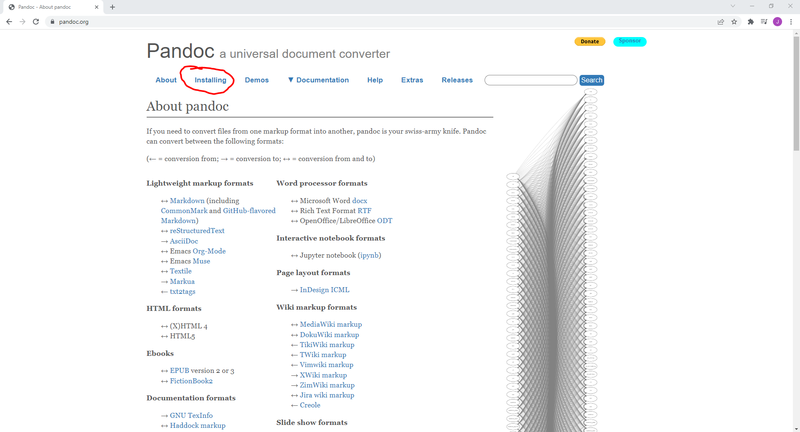

# How to Convert Word Files to Markdown Using Pandoc

## PART 1: How to Download Pandoc

The critical necessity for converting files with Pandoc is, of course, having Pandoc. This section will guide you through downloading Pandoc.

### Tools

* Internet browser

### Steps

1. Open your internet browser
2. Type "Pandoc.org" in the search bar, and hit `Enter` on the keyboard. (see Figure 2.1)

    

    *(Figure 2.1)*
3. Click the "Installing" link towards the top of the screen. (see Figure 2.2)

    

    *(Figure 2.2)*
4. Follow the instructions on the page for how to install for your specific device (Windows/Mac/Linux)

    "What??!? Read Pandoc's instructions! I thought their instructions were bad!" Yes they are, but not for installation. I guess they just wanted to make things appear nice before people commited to using Pandoc as a way of advertisement.

Once you have finished following the installation instructions on the Pandoc website, you are done downloading Pandoc!

-------
Back to [main page](index.md)
