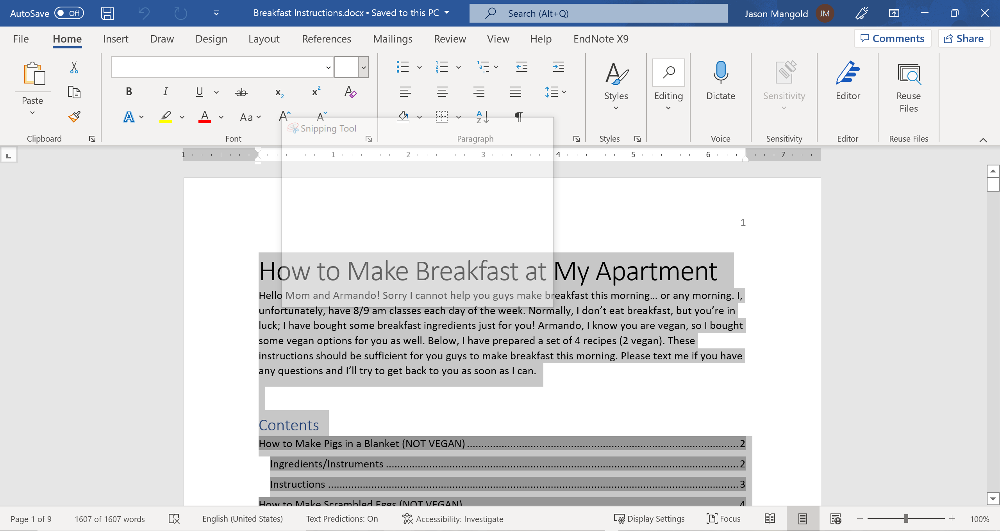

# How to Convert Word Files to Markdown Using Pandoc

## PART 2: How to Prepare Your Word Document

Now that you have everything that you need installed, you can now get to work on the conversions! First, we need to clean up our Word document so that Pandoc doesn't do anything funky with it.

### Tools

* Microsoft Word

### Steps

1. Create a new Word document

    This will be used for making changes to your Word document without destroying the original copy.
2. Select all contents (`Ctrl + a`) from your original document. (see Figure 3.1)

    

    *(Figure 3.1)* My apologies for the "Snipping Tool" watermark in the middle of the picture.
3. Copy all selected contents (`Ctrl + C`) from your original document.
4. Paste all copied contents (`Ctrl + V`) into your new document.

    **NOTE:** From this point on, all work will be completed in your new document.
5. Delete your title page and table of contents.

    These will need to be recreated manually in Markdown when we reach the post-Pandoc steps.
6. Save your new file to the same folder that your Markdown file will be saved to.

    I recommend naming the file "[insert name of original file]_EDITED"

You are now done with preparing your Word Document and may now proceed to the next steps!

-------
[Next Step](Converting-files.md)

Back to [main page](index.md)
