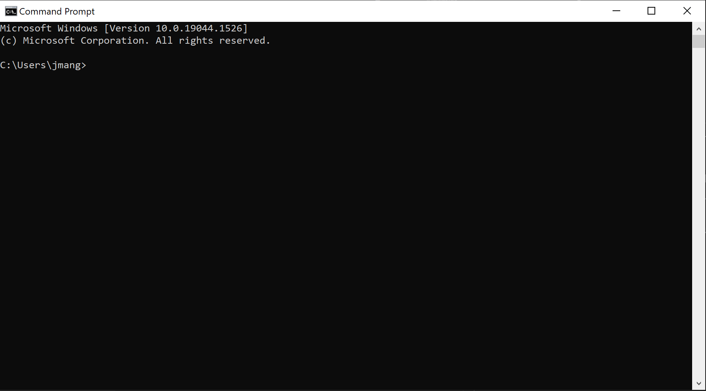

# How to Convert Word Files to Markdown Using Pandoc

I've written this How-To because the current Pandoc documentation isn't so user-friendly. Hopefully you can use this guide to help you complete your ENGL 3814 assignments.

**Note:** This is not a guide for how to write Word documents or how to write Markdown documents. Prior to reading this, students are expected to know how to do these things.

## Tools

* Internet browser (Chrome, Firefox, Safari, etc.)
* Office 365 (for Word)
* Visual Studio Code (VS Code)
* Command-Line interface

    For the non-CS students, this is usually referred to as the Terminal. It will look something like (see Figure 1).

    *Note:* If you are using Windows, please use PowerShell. You may use the default Command Prompt if you know how to use it. I do not know how to use it... so I shouldn't instruct you how to use it.

    

    *(Figure 1)*

## Table of Contents

* [PART 1: How to Download Pandoc](How-to-download-Pandoc.md)
* [PART 2: How to Prepare Your Word Document](Preparing-your-word-document.md)
* [PART 3: How to do the Conversion](Converting-files.md)
